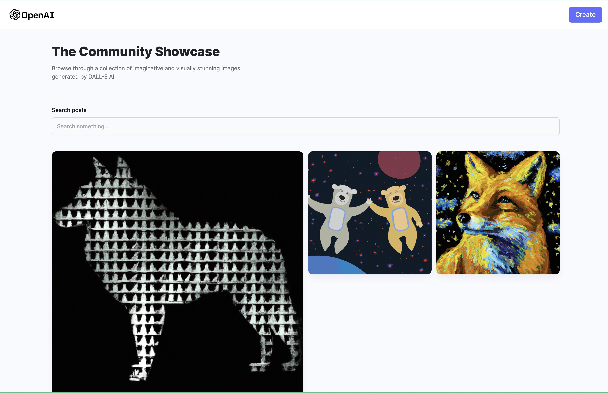
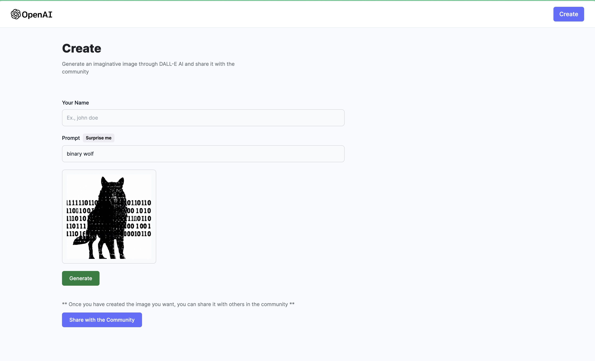

# Dalle-clone

This project is a DALL·E clone integrated with OpenAI and MongoDB to store the AI generated images & posts. DALL·E is a natural extension of GPT-3 that parses text prompts and then responds not with words but in pictures.

This app uses AI to create realistic images and art from a description in natural language.

#

Images

#

